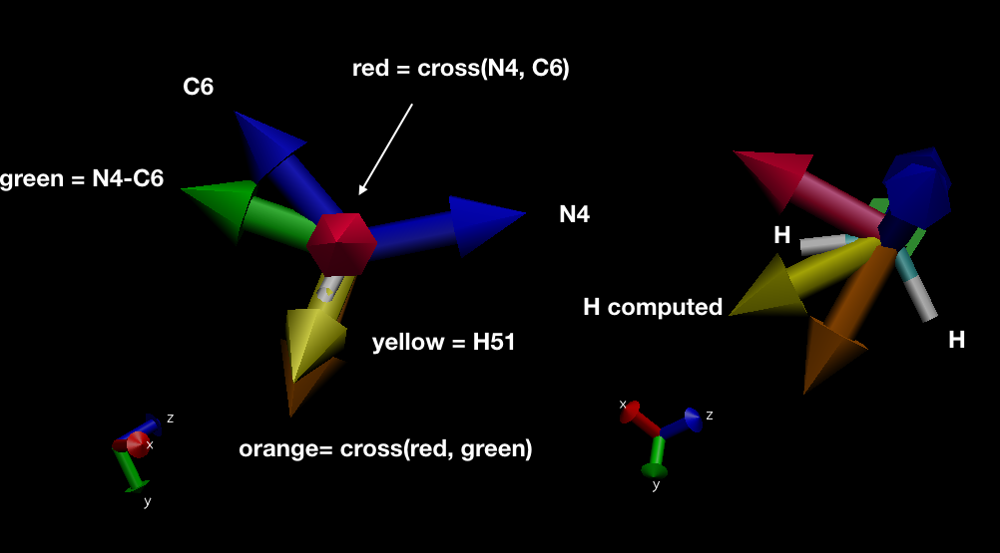

# buildH

This repository contains a project for reconstructing hydrogens from a united-atom trajectory and calculate the order parameter.

The initial motivation comes from the [NMRlipids](https://nmrlipids.blogspot.com/) project. As stated in this [post](https://nmrlipids.blogspot.com/2019/04/nmrlipids-ivb-assembling-pe-pg-results.html), so far there is a lack of suitable program for reconstructing hydrogens. In the past, we used to use g_protonate in GROMACS 3.* versions. But now, this program has been removed in recent versions. The idea is to build our own using python and a package such as MDAnalysis for reading a trajectory, as well as numpy and possibly others such as pandas.


BuildH can :
  - reconstruct hydrogens from a **united-atom** structure file (PDB, GRO) or a trajectory.
  - calculate the order parameter based on the reconstructed hydrogens
  - write a new structure/trajectory file with the reconstructed hydrogens


BuildH works in two modes :
  1.  A slow mode when an output trajectory (e.g. in xtc format) is requested by
     the user. In this case, the whole trajectory including newly built
     hydrogens are written to this trajectory.
  2. A fast mode without any output trajectory.


## Requirements

buildH is written in Python 3 and need the following modules :
  - numpy
  - pandas
  - MDAnalysis.


## Usage

```
$ python ./buildH_calcOP.py -h
usage: buildH_calcOP.py [-h] [-x XTC] [-l LIPID] [-d DEFOP] [-opx OPDBXTC]
                        [-o OUT]
                        topfile

This program builds hydrogens and calculate the order parameters (OP) from a
united-atom trajectory. If -opx is requested, pdb and xtc output files with
hydrogens are created but OP calculation will be slow. If no trajectory output
is requested (no use of flag -opx), it uses a fast procedure to build
hydrogens and calculate the OP.

positional arguments:
  topfile               Topology file (pdb or gro).

optional arguments:
  -h, --help            show this help message and exit
  -x XTC, --xtc XTC     Input trajectory file in xtc format.
  -l LIPID, --lipid LIPID
                        Residue name of lipid to calculate the OP on (e.g.
                        Berger_POPC).
  -d DEFOP, --defop DEFOP
                        Order parameter definition file. Can be found on
                        NMRlipids MATCH repository:https://github.com/NMRLipid
                        s/MATCH/tree/master/scripts/orderParm_defs
  -opx OPDBXTC, --opdbxtc OPDBXTC
                        Base name for trajectory output with hydrogens. The
                        extension will be automatically added. For example
                        -opx trajH will generate trajH.pdb and trajH.xtc. So
                        far only xtc is supported.
  -o OUT, --out OUT     Output text file with order parameters (default name
                        is OP_buildH.out)
```

The program needs two mandatory files (present in this repo):
- `dic_lipids.py` (option `-l`) ;
- `order_parameter_definitions_MODEL_Berger_POPC.def` (option `-d`).


#### dic_lipids.py

This file is used as a module and contains a list of dictionaries based on the type of lipids (POPC,DOPC,...) and the force field (Berger, GROMOS, etc). The chosen lipid/FF is passed to `buildH_calcOP.py` with `-l` option (e.g. `-l Berger_POPC`).
The dictionary is a list of carbon atoms from which the hydrogens are built.
For each carbon atom, there is the type of bonds (CH3, CH2, etc) and the 2 (or 3) others atoms needed for the reconstruction (see Algorithm).

#### order_parameters_definitions_MODEL_X_Y.def

This file is a mapping file created for the  [NMRlipids](https://nmrlipids.blogspot.com/) project.
It aims to give a unique name for each order parameter value along the lipid regardless the model of lipid used.


## Examples

You can find some test cases in the corresponding folder.

Examples of ways of launching the program:

```
python ./buildH_calcOP.py popc_start.pdb -l Berger_POPC -d order_parameter_definitions_MODEL_Berger_POPC.def

python ./buildH_calcOP.py popc_start.pdb -l Berger_POPC -d order_parameter_definitions_MODEL_Berger_POPC.def -o OP_buildH.out

python ./buildH_calcOP.py popc_start.pdb -l Berger_POPC -d order_parameter_definitions_MODEL_Berger_POPC.def -x traj.xtc

python ./buildH_calcOP.py popc_start.pdb -l Berger_POPC -d order_parameter_definitions_MODEL_Berger_POPC.def -x traj.xtc -opx popc_with_H
```

## Algorithm of the hydrogen reconstruction

The way of building H is largely inspired from a code of Jon Kapla originally written in fortran :
https://github.com/kaplajon/trajman/blob/master/module_trajop.f90#L242.

Below, an example of a reconstruction of 2 hydrogens (*H51* and *H52*) attached to a carbon *C5* with the help of 2 others atom *C6* and *N4*.



First, we compute the cross product between the vector C5-C6 and C5-N4 (red).

We determine a rotational axis determined by the vector N4-C6. (green)

We compute the cross product between the red one and green one. (orange)

This orange vector is the rotational vector to construct the hydrogens.

For this case, 2 hydrogens are constructed (yellow) : we apply a rotation of 109.47 deg for one and -109.47 deg for the other one.


## Contributors

  - Patrick Fuchs
  - Amélie Bacle
  - Hubert Santuz
  - Pierre Poulain


## Licence

buildH is licensed under the [BSD License](LICENSE).
